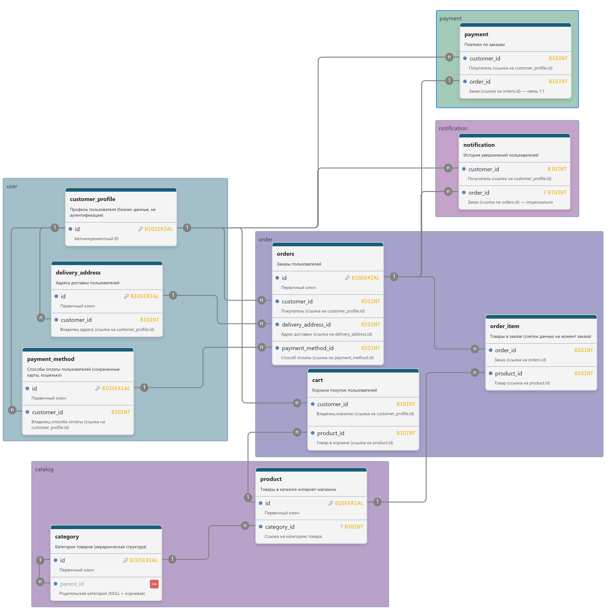

# Домашнее задание: Паттерны декомпозиции микросервисов

**Исполнитель:** Рыжков Евгений Васильевич  
**Кейс:** Интернет-магазин

---

## 1. Метод декомпозиции

Для разбиения монолита выбран комбинированный метод:

1. **Первичное разбиение** на основе **Бизнес-возможностей (Business Capabilities)**.
2. **Уточнение границ** через **Предметно-ориентированное проектирование (DDD, Domain-Driven Design)**.

### Обоснование

- **Отказ от метода «по кнопкам» (функциональное моделирование).**  
  Этот метод приводит к созданию «распределенного монолита». Сервисы будут вынуждены постоянно обращаться 
друг к другу, что увеличивает связанность и усложняет масштабирование.

- **Отказ от метода «по транзакциям».**  
  Процесс покупки является длительным и асинхронным по своей природе. Его невозможно поместить
в рамки одной транзакции. Это вынудило бы создать единый «мега-сервис», который нельзя независимо
масштабировать.

- **Выбор метода «бизнес-возможностей».**  
  Этот метод наиболее стабилен. Он отражает структуру бизнеса, а не его временную реализацию.

- **Уточнение через DDD.**  
  DDD используется как инструмент проверки. Он определяет, какие данные принадлежат каждому сервису.

---

## 2. Первичное разбиение на Бизнес-возможности

| Бизнес-возможность            | Описание                               | Черновой сервис         |
|:------------------------------|:---------------------------------------|:------------------------|
| **Управление пользователями** | Профиль, адреса, способы оплаты        | **UserService**         |
| **Управление каталогом**      | Товары, категории, цены                | **ProductService**      |
| **Управление заказами**       | Корзина, заказы, статусы               | **OrderService**        |
| **Обработка платежей**        | Списание средств, интеграция с банками | **PaymentService**      |
| **Информирование клиентов**   | Email, SMS, push-уведомления           | **NotificationService** |

---

## 3. Пользовательские сценарии

Для проверки корректности разбиения определены пользовательские сценарии.

- **US-1:** Покупатель регистрируется и входит в систему.
- **US-2:** Покупатель ищет товары по названию и категориям.
- **US-3:** Покупатель просматривает карточку товара.
- **US-4:** Покупатель добавляет товары в корзину.
- **US-5:** Покупатель оформляет заказ (адрес, оплата).
- **US-6:** Покупатель отслеживает статус заказа.
- **US-7:** Покупатель получает уведомления о статусе заказа.

---

## 4. Модель предметной области

Для проверки границ сервисов построена модель предметной области. Используется **ER-диаграмма**.

**Результат уточнения:** Границы контекстов совпали с черновыми сервисами. Первичное разбиение подтверждено.

---

## 6. Итоговый список сервисов

| Сценарий       | Контекст     | Сервис                  |
|:---------------|:-------------|:------------------------|
| **US-1**       | User         | **UserService**         |
| **US-2, US-3** | Catalog      | **ProductService**      |
| **US-4, US-5** | Order        | **OrderService**        |
| **US-5**       | Payment      | **PaymentService**      |
| **US-6, US-7** | Notification | **NotificationService** |

---

## 7. Схема взаимодействия сервисов

Для визуализации архитектуры построена **контейнерная диаграмма (C4 Model)**. Она показывает сервисы, базы данных и внешние компоненты.

---

## 8. Описание микросервисов

### 8.1. Сервис пользователей (UserService)

- **Назначение:** Управление профилем пользователя, адресами, способами оплаты.
- **Зона ответственности:** Данные профиля (синхронизированы с Keycloak), адреса доставки, сохраненные карты.
- **API:**
    - `GET /api/v1/profile` — профиль пользователя.
    - `PUT /api/v1/profile` — обновить профиль.
    - `GET /api/v1/profile/addresses` — список адресов.
    - `POST /api/v1/profile/addresses` — добавить адрес.
    - `GET /api/v1/profile/payment-methods` — способы оплаты.
- **События:** `CustomerUpdated`, `AddressAdded`.
- **Особенность:** Не хранит пароли (аутентификация — в Keycloak).

### 8.2. Сервис каталога (ProductService)

- **Назначение:** Хранение и предоставление информации о товарах и категориях.
- **Зона ответственности:** Товары, цены, категории, поиск.
- **API:**
    - `GET /api/v1/products?search={query}` — поиск товаров.
    - `GET /api/v1/products/{id}` — карточка товара.
    - `GET /api/v1/categories` — список категорий.
- **События:** `ProductCreated`, `ProductUpdated`.

### 8.3. Сервис заказов (OrderService)

- **Назначение:** Логика создания заказов, управление корзиной и статусами.
- **Зона ответственности:** Корзина, заказы, товары в заказе.
- **API:**
    - `GET /api/v1/cart` — получить корзину.
    - `POST /api/v1/cart/items` — добавить товар.
    - `POST /api/v1/orders` — оформить заказ.
    - `GET /api/v1/orders/{id}` — получить заказ.
- **Взаимодействие:** Вызывает ProductService (проверка цены), UserService (адрес).
- **События:** Публикует `OrderCreated`, `OrderConfirmed`, `OrderCancelled`.

### 8.4. Сервис платежей (PaymentService)

- **Назначение:** Обработка финансовых транзакций.
- **Зона ответственности:** Платежи, возвраты, интеграция с платежным шлюзом.
- **API:**
    - `POST /api/v1/payments` — инициировать оплату.
    - `GET /api/v1/payments/{id}` — статус платежа.
- **Взаимодействие:** Слушает `OrderCreated`. Публикует `PaymentCompleted`, `PaymentFailed`.

### 8.5. Сервис уведомлений (NotificationService)

- **Назначение:** Отправка уведомлений (email, SMS, push).
- **Зона ответственности:** История уведомлений, шаблоны.
- **API:**
    - `POST /api/v1/notifications` — отправить уведомление (ручной триггер).
- **Взаимодействие:** Слушает `OrderCreated`, `PaymentCompleted`, `OrderConfirmed`, `OrderCancelled`.

---

## 9. Контракты взаимодействия

| Отправитель             | Получатель         | Метод / Событие                                              | Описание                |
|:------------------------|:-------------------|:-------------------------------------------------------------|:------------------------|
| **OrderService**        | **ProductService** | `GET /api/v1/products/{id}`                                  | Проверка цены и наличия |
| **OrderService**        | **UserService**    | `GET /api/v1/profile/addresses/{id}`                         | Получить адрес          |
| **OrderService**        | **Message Broker** | Событие `OrderCreated`                                       | Триггер оплаты          |
| **PaymentService**      | **Message Broker** | Событие `PaymentCompleted`                                   | Уведомление об оплате   |
| **PaymentService**      | **Message Broker** | Событие `PaymentFailed`                                      | Ошибка оплаты           |
| **OrderService**        | **Message Broker** | Событие `OrderConfirmed`                                     | Подтверждение заказа    |
| **NotificationService** | —                  | Слушает `OrderCreated`, `PaymentCompleted`, `OrderConfirmed` | Отправка уведомлений    |
---

## 10. Архитектурные требования

### 10.1. Брокер сообщений (Message Broker)

Для связи сервисов используется **Брокер сообщений** (RabbitMQ или Kafka).
Это обеспечивает слабую связность и независимость сервисов.

### 10.2. Паттерн Сага (Saga)

Для согласованности распределенных операций используется **паттерн Сага** в режиме хореографии.

- **Процесс:**
    1. OrderService создает заказ (Статус: `CREATED`). Публикует `OrderCreated`.
    2. PaymentService списывает средства. Публикует `PaymentCompleted`.
    3. При ошибке оплаты PaymentService публикует `PaymentFailed`.
    4. OrderService переводит заказ в статус `CANCELLED`. Публикует `OrderCancelled`.

### 10.3. Идемпотентность (Idempotency)

- **Механизм:** PaymentService хранит ключ идемпотентности (`idempotency_key`).
Повторный запрос с тем же ключом не выполняет новое списание.

### 10.4. Аутентификация и авторизация

Используется **Keycloak** (IAM) + **API Gateway** (Spring Cloud Gateway).

- **Механизм:**
    1. Клиент логинится в Keycloak, получает JWT.
    2. Запросы проходят через API Gateway.
    3. Gateway проверяет JWT и пробрасывает `X-User-Id` в сервисы.
    4. Сервисы доверяют Gateway и не валидируют JWT сами.

### 10.5. Логирование и Мониторинг

- **Логирование:** JSON-логи → ELK / Graylog.
- **Мониторинг:** Prometheus + Grafana.
- **Трассировка:** OpenTelemetry + Jaeger (заголовок `trace_id`).